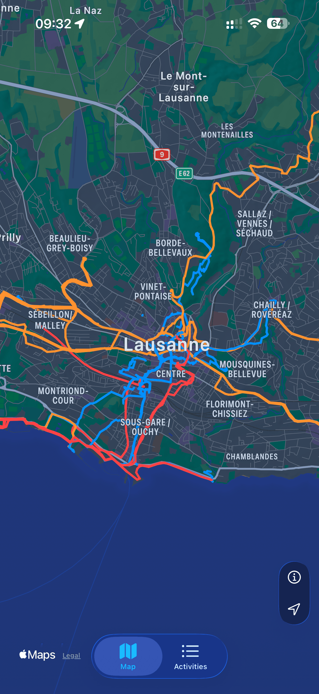
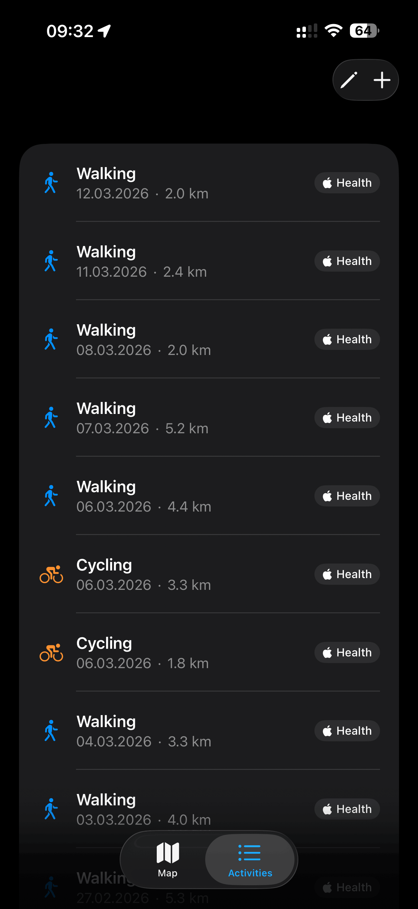
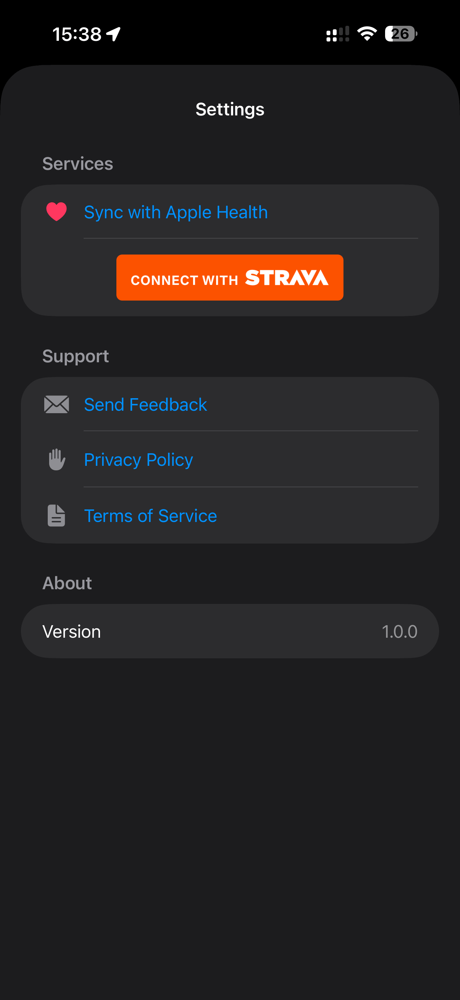
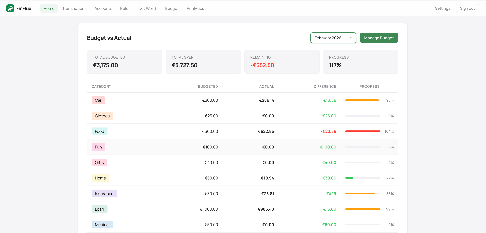
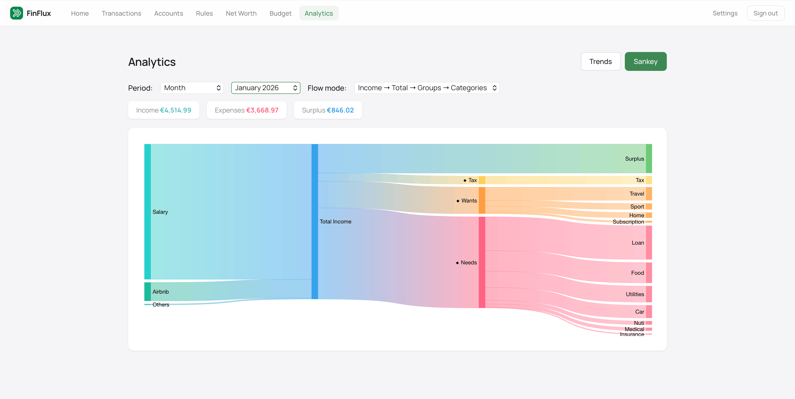
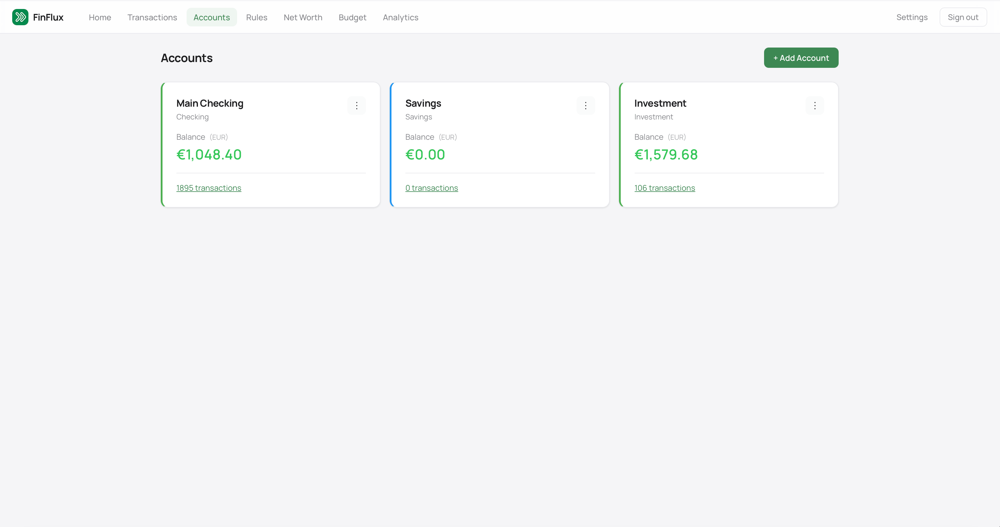

## Personal Projects

Apps and side projects I build outside of my academic research.

 

  
  

    <h3 class="app-name">Pathly</h3>
    

      All your adventures. One map. 
      See every run, hike, and ride from Apple Health, Strava, and files beautifully visualized together.
    

    

      iOS
      Maps
      Health & Fitness
    

    

      <a href="https://apps.apple.com/app/pathly-maps/id6747246128" class="app-store-badge" target="_blank" rel="noopener">
        <i class="fab fa-app-store-ios"></i>&nbsp; Download on the App Store
      </a>
    

  

  
  
  

 

  
  

    <h3 class="app-name">Finflux Beta</h3>
    

      Your finances, under control. 
      Import transactions, plan budgets, and track spending across all your accounts — with smart transfer detection and auto-categorization rules.
    

    

      Web App
      Finance
      Budgeting
    

    

      <a href="https://finflux.ch" class="app-store-badge" target="_blank" rel="noopener">
        <i class="fas fa-globe"></i>&nbsp; Visit finflux.ch
      </a>
    

  

  
  
  

